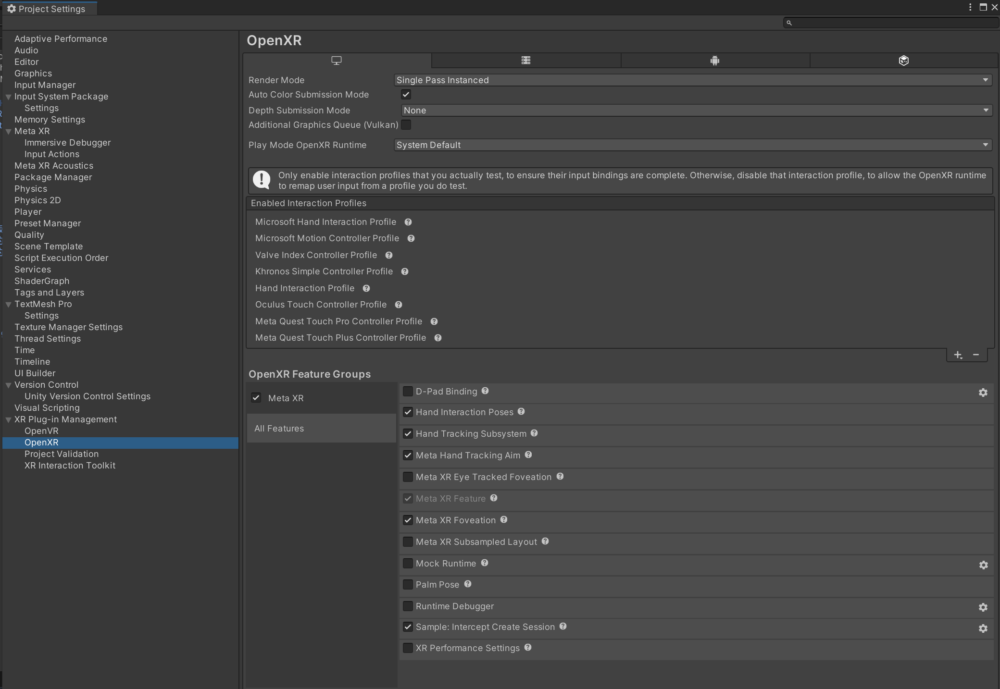
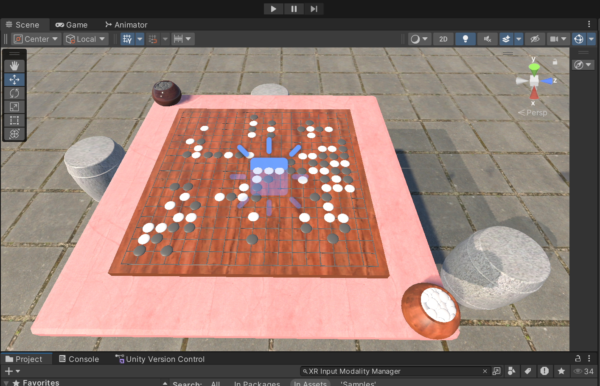

<!--
 * @Author: Zeta112233 15311410306@163.com
 * @Date: 2025-11-12 15:36:55
 * @LastEditors: Zeta112233 15311410306@163.com
 * @LastEditTime: 2025-12-25 00:48:37
 * @FilePath: \ChessVR\README.md
 * @Description: 这是默认设置,请设置`customMade`, 打开koroFileHeader查看配置 进行设置: https://github.com/OBKoro1/koro1FileHeader/wiki/%E9%85%8D%E7%BD%AE
-->
# ChessVR - VR 五子棋交互项目

这是一个基于 Unity XR Interaction Toolkit (XRI) 和 XR hand 开发的 VR 围棋/五子棋交互演示项目。本项目旨在探索 VR 环境下的人机交互设计，核心关注点是对于棋子的抓取、吸附，放置等体验，以及使用手势操作来与棋盘进行交互。

## 项目简介

本项目实现了一个沉浸式的 VR 下棋环境，核心功能包括：

*   **棋子吸附**：棋子在接近棋盘格点时会自动吸附，辅助落子。
*   **混合抓取交互**：
    *   **近距离**：直接伸手抓取棋子。
    *   **远距离**：支持“隔空取物”（Ray Interactor），使用射线远程抓取棋子。
*   **自动对齐**：场景中预设的棋子在运行瞬间会自动吸附到最近的合法格点，不合法则删除棋子。
*   **棋盒交互**：从棋盒中抓取以拿取新棋子，放回棋盒为删除。
*   **悔棋功能**：支持悔棋操作，右手手势可以撤销最近的一步棋。
*   **清盘功能**：支持清盘操作，左手手势清空棋盘。
*   **其他手势**：其他手势当前可识别，但未绑定功能。也可录制自定义手势。

## 开发环境

**为了确保项目能正常运行，请使用以下环境配置：**

*   **Unity 版本**：Unity 2022.3.61t8 (Tuanjie 1.6.7) 或更高版本

*   **XR 插件与依赖**：
    *   在Unity的 Windows Package Manager 中安装以下包：
        *   **XR Interaction Toolkit** (3.2.1) - 核心交互框架
        *   **XR Hands** (1.4.3) - 手势追踪支持
        *   **XR Core Utilities** (2.5.3) - XR 基础工具
        *   **XR Plugin Management** (4.5.3) - XR 插件管理
        *   **OpenXR Plugin** (1.14.3) - 通用 VR 设备支持

*   **硬件支持**：
    *   Meta Quest 2/3/3s/Pro (通过 steamlink 连接 steamVR 进行串流)
    *   应该也支持其他 SteamVR / OpenXR 的 PCVR 头显，但未做测试

*   **在Unity的 Edit - Project Setting 中进行如图设置**
    

## 如何运行

1.  **环境准备**：
    *   确保已安装 Unity Hub 和1.6.7及以上版本的 Unity 编辑器。
    *   确保 VR 头显已与SteamVR串流，并显示出steamvr场景。
2.  **打开项目**：
    *   在 Unity Hub 中添加本项目根目录。
    *   打开项目，等待资源导入完成。
3.  **运行场景**：
    *   直接点击编辑器顶部的 **Play** 按钮即可运行。（左侧三角）
    
4.  **操作说明**：
    *   **手柄模式**：
        *   **移动**：使用左手摇杆进行传送（Teleport）或平滑移动。
        *   **抓取**：将手柄靠近棋子或用射线指向棋子，按下 **Grip（侧键）** 抓取。
        *   **落子**：将棋子移动到棋盘上方，松开 Grip 键，棋子会自动吸附到最近的交叉点。
        *   **拿取新棋子**：将手伸入棋盒或用射线指向棋盒，按下 Grip 键生成新棋子。
    *   **手势模式**：
        *   **移动**：无法移动。目前未设置手势状态下的移动功能
        *   **抓取/落子**：握拳手势为抓取，张开手为落子。可使用近距离交互和射线远距离交互。
        *   **悔棋**：右手手势可以撤销最近的一步棋。
        *   **清盘**：左手手势清空棋盘。
## 关键脚本说明

关键的脚本逻辑为`Assets/Scripts` 下的以下文件：

*   **`GoGameManager.cs`**：全局管理器，负责维护棋盘格点数据、判断落子规则（如禁入点）、管理悔棋（Undo）历史。
*   **`GoGridGenerator.cs`**：用于根据棋盘模型的 MeshRenderer 自动生成 19x19 的格点坐标，给棋子吸附用。
*   **`GoPieceVRSnap.cs`**：挂载在棋子上，负责检测松手事件，调用 Manager 进行吸附判定或销毁无效棋子。
*   **`GoBoxInteractable.cs`**：挂载在棋盒上，负责处理交互事件，生成新棋子，并提供一个碰撞体积用于检测是否进入棋盒。

---
*人机交互作业 - 2025*
